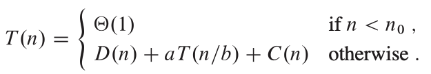
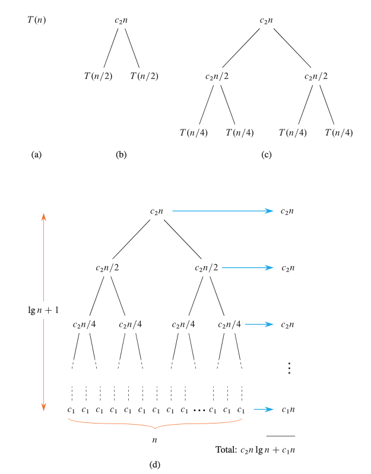
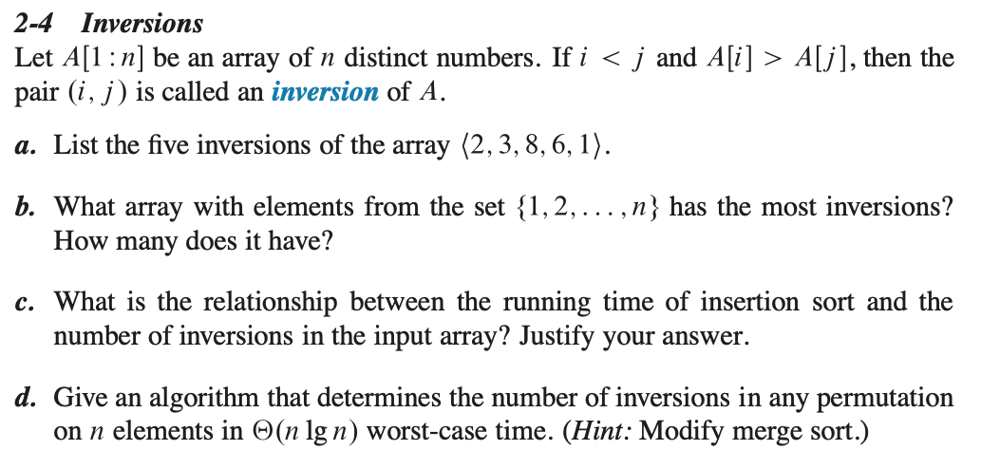
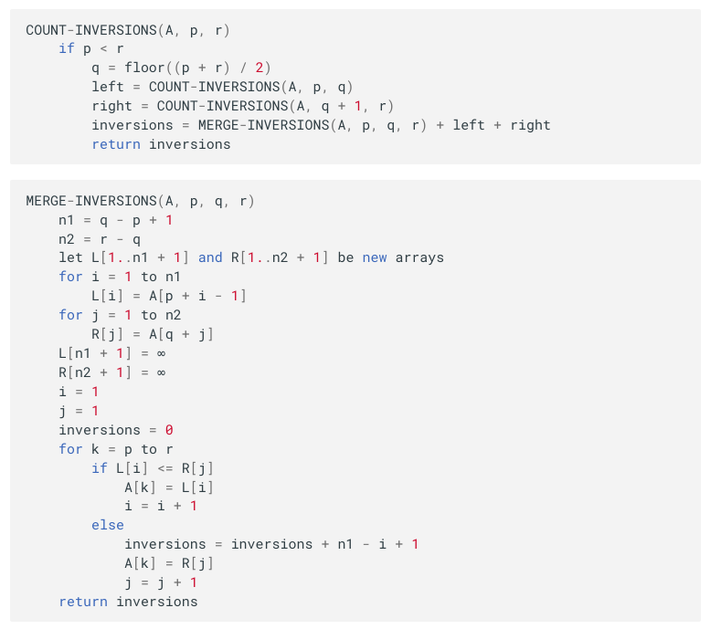
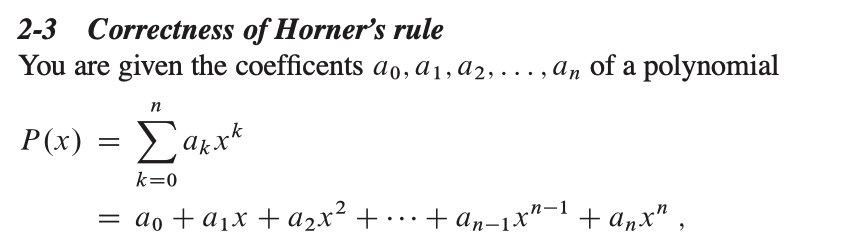
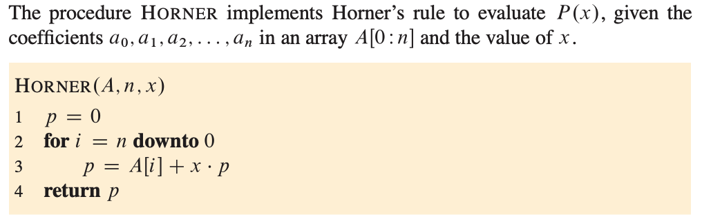

# Designing Algorithms

You can choose from a wide range of algorithm design techniques. Insertion sort uses the incremental method: for each element A[i], insert it into its proper place in the subarray A[1:i], having already sorted the subarray A[1:i-1]

### The divide-and-conquer method

In the divide-and-conquer method, if the problem is small enough the base case you just solve it directly without recursing. Otherwise the recursive case you perform three characteristic steps:

- **Divide** the problem into one or more subproblems that are smaller instances of the same problem.
- **Conquer** the subproblems by solving them recursively.
- **Combine** the subproblem solutions to form a solution to the original problem.

### Analyzing divide-and-conquer algorithms

When an algorithm contains a recursive call, you can often describe its running time by a recurrence equation or recurrence

If the problem size is small enough, say n < n0 for some constant n0 > 0, the straightforward solution takes constant time, which we write as $\theta$(1). Suppose that the division of the problem yields a subproblems, each with size n/b , that is, 1/b the size of the original. For merge sort, both a and b are 2, but we’ll see other divide-and-conquer algorithms in which a != b. It takes time T(n/b) to solve one subproblem of size n/b, and so it takes aT(n/b) time to solve all of them. If it takes D(n) time to divide the problem into subproblems and C(n) time to combine the solutions to the subproblems into the solution to the original problem, we get the recurrence

### Analysis of merge sort

Here's how to set up the recurrence for T(n), the worst-case running time of merge sort on n numbers.

- **Divide** The dive step just computes the middle of the subarray, which takes constant time, D(n) = $\theta$(1).
- **Conquer** Recursively solving two subproblems, each of size n/2, contributes 2T(n/2) to running time.
- **Combine** Since the merge procedure on a n-element subarry takes $\theta$(n) time, we have C(n) = $\theta$(n).

from above we can say recurence as:

## T(n) = 2T(n/2) + $\theta$(n).

