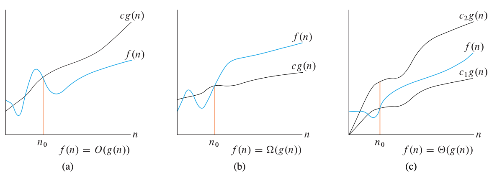

# O-notation $\Omega$-notation $\Theta$-notation

### O-notation

O-notation characterizes an upper bound on the asymptotic behavior of a function. In other words, it says that a function grows no faster than a certain rate, based on the highest-order term. Consider, for example, the function 7n3 + 100n2 - 20n + 6. Its highest order term is 7n3 and so we say that this function’s rate of growth is . Because this function grows no faster than , we can write that it is O(n3). You might be surprised that we can also write that the function 7n3 + 100n2 - 20n + 6 is O(n4). Why? Because the function grows more slowly than n4, we are correct in saying that it grows no faster. this function is also O(n5), O(n6), and so on. More generally, it is O(nc) for any constant c >= 3.

### $\Omega$-notation

$\Omega$-notation characterizes a lower bound on the asymptotic behavior of a function. In other words, it says that a function grows at least as fast as a certain rate, based as in O-notation on the highest order term. Because the highest-order term in function 7n3 + 100n2 - 20n + 6 grows atleast as fast as n3, this function is $\Omega$(n2) and $\Omega$(n). More generally, it is $\Omega$(nc) for any constant <= 3.

### $\Theta$-notation

$\Theta$-notation characterizes a tight bound on the asymptotic behavior of a function. It says that a function grows precisely at a certain rate, based on the highest-order term. Put another way, $\Theta$-notation characterizes the rate of growth of the function to within a constant factor from above and to within a constant factor from below. These two constant factors need not be equal.

If you can show a function is both O(f(n)) and $\Theta$(f(n)) for some function f(n), then you have shown that function is $\Theta$(f(n)) For example, since the function 7n3 + 100n2 - 20n + 6 is both O(n3) and $\Omega$(n3), it is also $\Theta$(n3).

