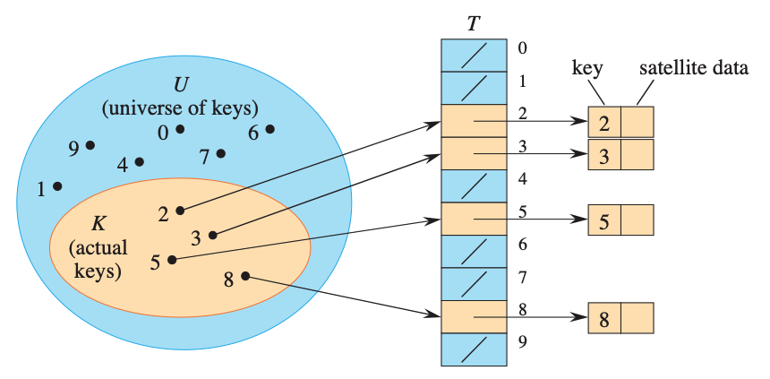
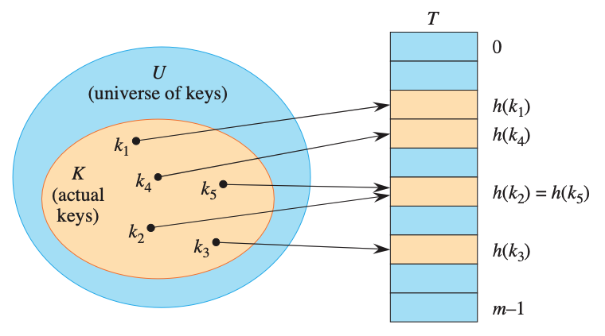
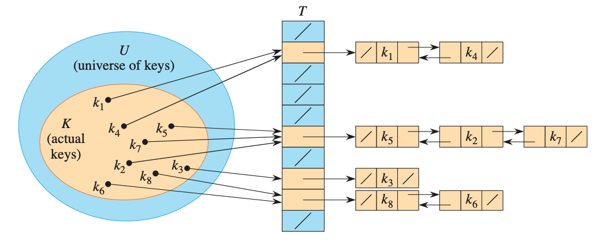

# Hash Tables
Many applications require a dynamic set that supports only the dictionary opera- tions INSERT, SEARCH, and DELETE.
For example, a compiler that translates a programming language maintains a symbol table, in which the keys of elements are arbitrary character strings corresponding to identiûers in the language. A hash table is an effective data structure for implementing dictionaries.

Although search- ing for an element in a hash table can take as long as searching for an element in a linked list4 time in the worst case4in practice, hashing performs extremely well. Under reasonable assumptions, the average time to search for an element in a hash table is . Indeed, the built-in dictionaries of Python are implemented with hash tables.

### Direct-address tables
Direct addressing is a simple technique that works well when the universe of keys is reasonably small. Suppose that an application needs a dynamic set in which each element has a distinct key drawn from the universe U={0,1,...,m-1}, where m is not too large.

To represent the dynamic set, you can use an array, or direct-address table, de- noted by T[0:m-1] in which each position, or slot, corresponds to a key in the universe U.



```
DIRECT-ADDRESS-SEARCH(T,k) 
1 return T[k]

DIRECT-ADDRESS-INSERT(T,x) 
1 T[x.key] = x

DIRECT-ADDRESS-DELETE(T,x) 
1 T[x.key] = NIL
```

The downside of direct addressing is apparent: if the universe U is large or inûnite, storing a table T of size |U| may be impractical, or even impossible, given the memory available on a typical computer. Furthermore, the set of keys actually stored may be so small relative to U that most of the space allocated for T would be wasted.

With direct addressing, an element with key k is stored in slot k, but with hashing, we use a hash function h to compute th slot number from the key k

the hash function h maps the universe U of keys to slots of hash table T[0:m-1]

h:U -> {0,1,...,m-1}

where the size of the hash table is typically much less than |U|.



There is one hitch, namely that two keys may hash to the same slot. We call this situation a collision. Fortunately, there are effective techniques for resolving the conüict created by collisions.

### independent uniform hashing
An ideal hashing function would have, for each possible input in the do- main , an output that is an element randomly and independently chosen uniformly from the range . Once a value is randomly cho- sen, each subsequent call to with the same input yields the same output .
We call such an ideal hash function an independent uniform hash function. Such a function is also often called a random oracle. When hash tables are implemented with an independent uniform hash function, we say we are using independent uniform hashing.



each nonempty slot points to a linked list, and all elements that hash to the same slot go into the slot's linked list.

### Open addressing

a method for collision resolution that unlike chaining does not make use of storage outside of the hash table itself. In open addressing, all elements occupy hash table itself

Collisions are handled as follows: when a new element is to be inserted into the table, it is placed in its <ûrst-choice= location if possible. If that location is already occupied, the new element is placed in its second-choice location. The process continues until an empty slot is found in which to place the new element. Different elements have different preference orders for the locations.

```
HASH-INSERT(T,k)
1 i = 0
2 repeat
3   q = h(k,i)
4   if T[q] == NIL
5       T[q] = k
6       return q
7   else i = i+1
8 until i == m
9 error "hash table overflow"

HASH-SEARCH(T,k)
1 i = 0
2 repeat
3   q = h(k,i)
4   if T[q] == k
5       return q
6   i = i+1
7 until T[q] == NIL or i == m
8 return NIL
```

