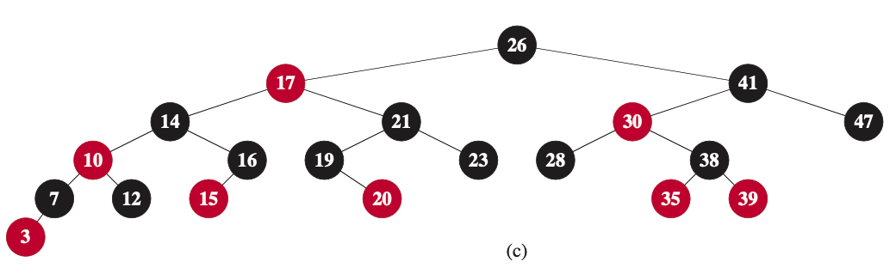
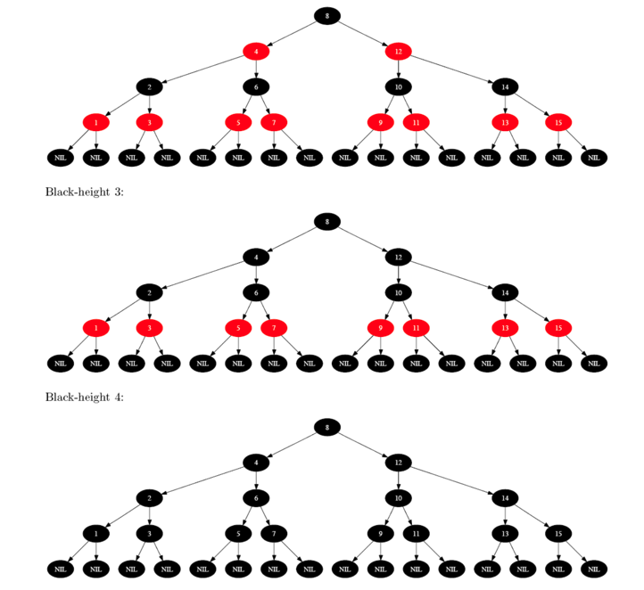
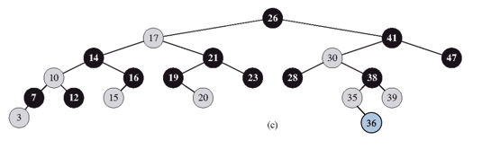
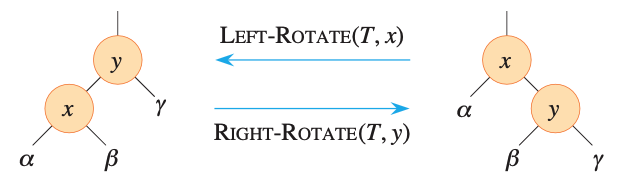
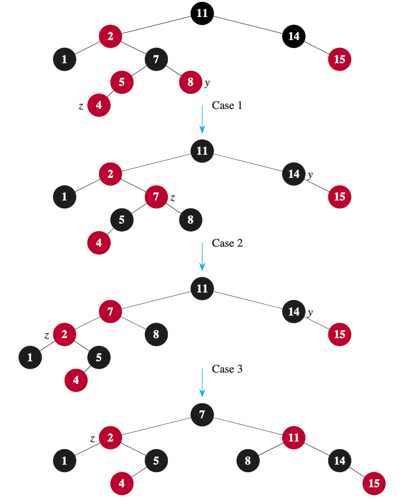
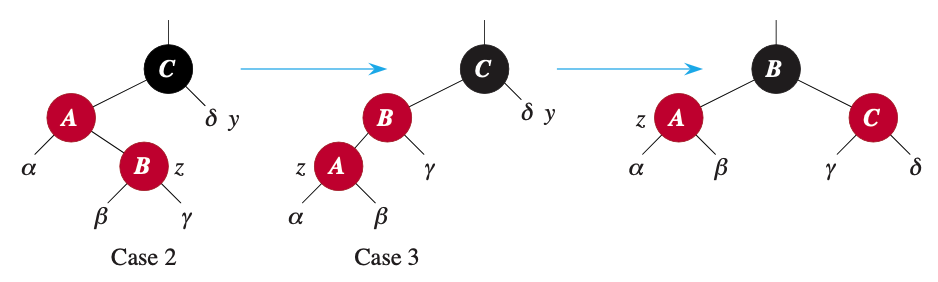
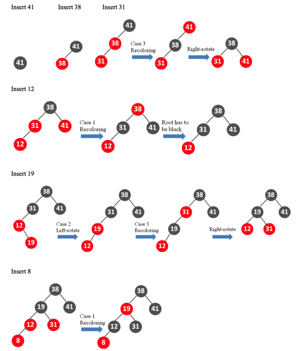
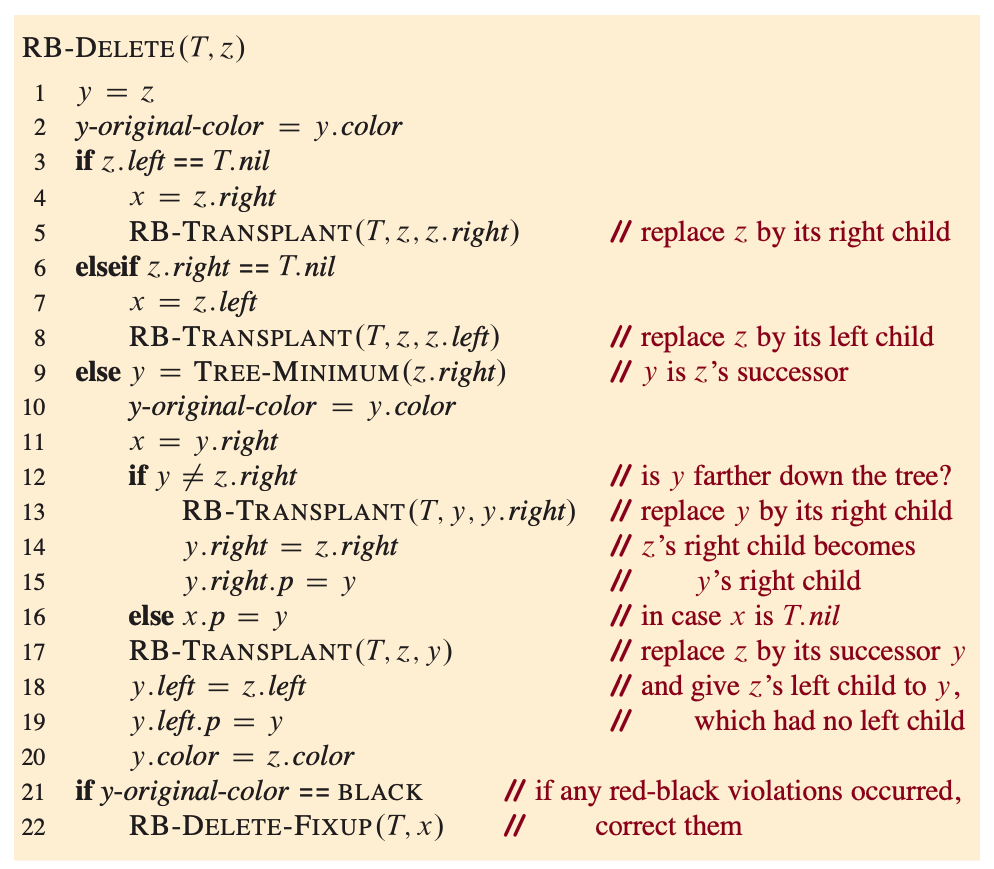
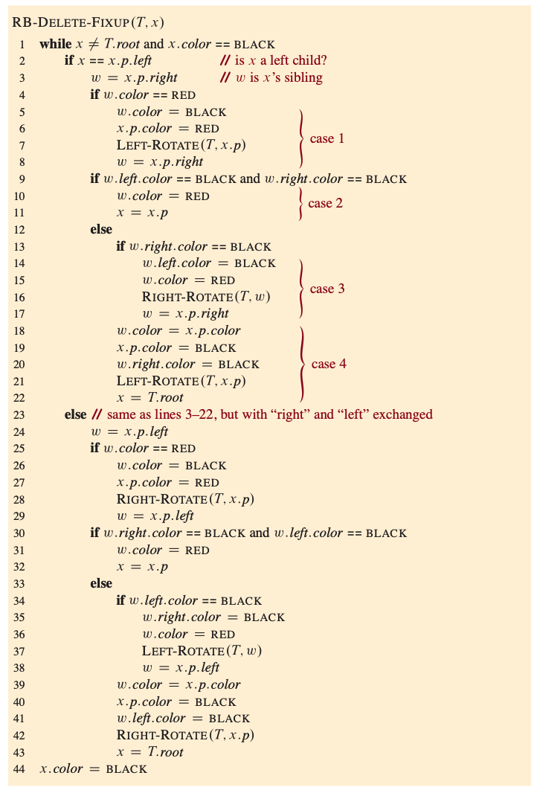

# Red-Black Trees
Red-black trees are one of many search-tree schemes that are balanced in order to guarantee that basic dynamic-set operations take O(lgn) time in worst case.

### properties of red-black trees
A red-black tree is binary earch tree with one extra bit of storage per node: its color, which can be either RED or BLACK.
the height of red-black tree with n keys is atmost 2lg(n+1), which is O(lgn).

A red-black tree is a BST that satisfies the following properties:
- Every node is either red or black.
- The root is black.
- Every leaf (NIL) is black.
- If a node is red, then both its children are black.
- For each node, all simple paths from the node to descendant leaves contain same number of black nodes



### Excercise

- draw the complete binary search tree of height 3 on the keys {1,2,...,15}. Add the NIL leaves and color the nodes in three different ways such that the black-heights of the resulting red-black trees are 2, 3, and 4.

<details>
    <summary><strong>Check Answer</strong></summary>
    
</details>
<br>

- Draw the red-black tree that results after TREE-INSERT is called on the tree in Figure 13.1 with key 36. If the inserted node is colored red, is the resulting tree a red-black tree? What if it is colored black?

<details>
    <summary><strong>Check Answer</strong></summary>
    
    
    Node is Red: This is not a Rid-Black tree, because after every red node, the children must be black. Hence, a red 36 would break the tree's properties.

    Node is Black: This alters the Black-height of the tree. However, all the other simple paths have their old Black-height. This breaks the property of the Red-Black tree, and thus it is not a Red-Black tree.

    To add anything to a tree, the tree needs to be re-arranged and re-painted each time to match its properties.
    
</details>

### Rotations
The search-tree operations TREE_INSERT and TREE-DELETE, when run on a red-black tree with n keys, take O(lgn) time. Because they violate the red-black properties enumerated. To restore these properties, colors and pointers within nodes need to change.



```
LEFT-ROTATE(T,x)
1 y = x.right
2 x.right = y.left
3 if y.left != T.nil
4   y.left.p = x
5 y.p = s.p
6 if x.p == T.nil
7   T.root = y
8 elseif x == x.p.left
9   x.p.left = y
10 else x.p.right = y
11 y.left = x
12 x.p = y
```

The code for RIGHT-ROTATE is symmetric. Both LEFT-ROTATE and RIGHT-ROTATE run in O(1) 

### Insertion
The procedure RB-INSERT starts by inserting node z into the tree T as if it were an ordinary binary search tree and then it colors z red. To guarantee that the red-black properties are preserved, and auxiliary procedure RB-INSERT-FIXUP recolors nodes and performs rotations. 

```
RB-INSERT(T,z)
1 x = T.root // node being compared with z
2 y = T.nil // y will be parent of z
3 while x != T.nil
4   y = x
5   if z.key < x.key
6       x = x.left
7   else x = x.right
8 z.p = y // found the location - insert z with parent y
9 if y == T.nil
10  T.root = z  // tree T was empty
11 elseif z.key < y.key
12  y.left = z
13 else y.right = z
14 z.left = T.nil
15 z.right = T.nil
16 z.color = RED
17 RB-INSERT-FIXUP(T,z) // correct any violations of red-black properties
```

because coloring red may cause a violation of one of the red-black properties, line 17 RB_INSERT-FIXUP(T,z) called in order to restore the red-black properties.

```
RB-INSERT-FIXUP(T,z)
1 while z.p.color == RED
2   if z.p == z.p.p.left
3       y = z.p.p.right
4       if y.color == RED
5           z.p.color = BLACK
6           y.color = BLACK
7           z.p.p.color = RED
8           z = z.p.p
9       else
10          if z == z.p.right
11              z = z.p
12              LEFT-ROTATE(T,z)
13          z.p.color = BLACK
14          z.p.p.color = RED
15          RIGHT-ROTATE(T,z.p.p)
16  else 
17      y = z.p.p.left
18      if y.color == RED
19          z.p.color = BLACK
20          y.color = BLACK
21          z.p.p.color = RED
22          z = z.p.p
23      else 
24          if z == z.p.left
25              z = z.p
26              RIGHT-ROTATE(T,z)
27          z.p.color = BLACK
28          z.p.p.color = RED
29          LEFT-ROTATE(T,z.p)
30 T.root.color = BLACK
```



Initialization: 

Before RB-INSERT is called, the red-black tree has no violations.<br>

1. when RB-INSERT-FIXUP is called, z is the red node that was added.
2. If z.p is root, then z.p started out black and did not change before the call of RB-INSERT-FIXUP.
3. we have already seen that properties 1,3,5 hold when RB-INSERT-FIXUP is called. If the tree violates property 2 (the root must be black), then the red root must be the newly added node z, which is the only internla node in the tree. the tree does not also violate property 4. Thus this violation of property 2 is the only violation of red-black properties in the entire tree.
If the tree violates property 4, then, because the children of node z are black sentinels and the tree had no other violations prior to z being added, the violation must be because both z and z.p are red. Moreover, the tree violates no other red-black properties.

Maintainance:

There are six cases within while loop, but we'll examine only the three cases in lines 3-15, when node z's parent z.p is a left child of z's grandparent z.p.p. The proof for lines 17-29 is symmetric. The node z.p.p exists, since by part (b) of loop invariant, if z.p is the root, then z.p is black. Since RB-INSERT-FIXUP enters a loop iteration only if z.p is red, we know that z.p cannot be root. hence z.p.p exists.

case 1 differs from cases 2 and 3 by the color of z's uncle y. Line 3 makes y point to z's uncle z.p.p.right, and line 4 tests y's color. If y is red then case 1 executes. Otherwise, control passes to case 2 and 3. In all three cases, z's grandparent z.p.p is black, since its parent z.p is red, and property 4 is violated only between z and z.p.

case 1: z's uncle y is red

case 1 occurs when z.p and y are red. Because z's grandparent z.p.p is black, its blackness can transfer down one level to both z.p and y, thereby fixing the problem of z and z.p both being red. z's grandparent becomes red, there by maintaining property 5. The while loop repeats with z.p.p as the new node z

1. Because this iteration colors z.p.p red, node z' is red at the start of the next iteration.
2. The node z'.p is z.p.p.p in this iteration and color of this node does not change. If this node is the root, it was black prior to this iteration, and it remains black at the start of the next iteration.
3. We have already argued that case 1 maintains property 5, and it does not introduce a violation of properties 1 or 3.
If node z' is the root at the start of the next iteration, then case 1 corrected  the lone violation is property 4 in this iteration. since z' is red and it is the root, property 2 becomes the only one that is violated, and this violation is due to z'.
If node z' is not the root at the start of the next iteration, then case 1 has not created a violation of property 2. case 1 corrected the lone violation of property 4 that existed at the start of this iteration. It then made z' red and left z'.p alone. If z'.p was black, there is no violation of property 4. If z'.p was red, coloring z' red created violation of property 4, between z' and z'.p

case 2: z's uncle y is black and z is a right child<br>
case 3: z's uncle y is black and z is a left child<br>
In case 2 and 3, the color of z's uncle y is black. We distinguish the two cases, which assume that z's parent z.p is red and a left child, according to whether z is a right or left child of z.p which is shown in below figure together with case 3. In case 2, node z is a right child of its parent. A left rotation immediately transforms the situation into case 3, in which node z is a left child. Because both z and z.p are red, the rotation affects neither the black-heights of nodes nor property 5. Whether case 3 executes directly or through case 2, z's uncle y is black, since otherwise case1 would have run. Additionally, the node z.p.p exists, since we have argued that this node existed at the time that lines 2 and 3 were executed, and after moving up one level in line 11 and then down one level in line 12, the identity of z.p.p remains unchanged. Case 3 performs some color changes and a right rotation, which preserve property 5. At this point, there are no longer two red nodes in a row. The while loop terminates upon the next test in line 1, since z.p is now black.



We now show that cases 2 and 3 maintain the loop invariant.

1. case 2 makes z point to z.p, which is red. No further change to z or its color occurs in cases 2 and 3.
2. case 3 makes z.p black, so that if z.p is the root at the start of the next iteration, it is black.
3. As in case 1, properties 1, 3 and 5 are maintained in cases 2 and 3. Since node z is not the root in cases 2 and 3, we know that there is no violation of property 2. Cases 2 and 3 do not introduce a violation of property 2, since the only node that is made red becomes a child of a black node by the rotation in case 3.
Cases 2 and 3 correct the lone violation of property 4, and they do not introduce another violation.

Termination:

To see that the loop terminates, observe that if only case 1 occurs then the node pointer z moves toward the root in each iteration, so that eventually z.p is black. If either case 2 or case 3 occurs, then we'he seen that the loop terminates. Since the loop terminates because z.p is black. the tree does not vilate proerty 4 at the loop termination. By the loop invariant, the only property that might fail to hold is property 2 line 30 restores this property by coloring the root black, so that when RB-INSERT-FIXUP terminates, all the red-black properties hold.

Questions:

the color of the newly inserted node z to red. If in-stead z’s color were set to black, then property 4 of a red-black tree would not be violated. Why not set z’s color to black?

<details>
    <summary><strong>Check Answer</strong></summary>
    Property 5 is violated and there will be more black nodes.
</details>
<br>

Show the red-black trees that result after successively inserting the keys 41, 38, 31, 12, 19, 8 into an initially empty red-black tree.

<details>
    <summary><strong>Check Answer</strong></summary>
    
</details>
<br>

### Deletion

Like the other operations on an n-node red-black tree, deletion of a node takes O(lgn) time. Deleting a node from a red-black tree is more complicated than inserting a node.

First we define RB-TRANSPLANT subroutine so that RB-TREE-DELETE calls this

```
RB-TRANSPLANT(T, u, v)
1 if u.p == T.nil
2   T.root = v
3 elseif u == u.p.left
4   u.p.left = v
5 else u.p.right = v
6 v.p = u.p
```



