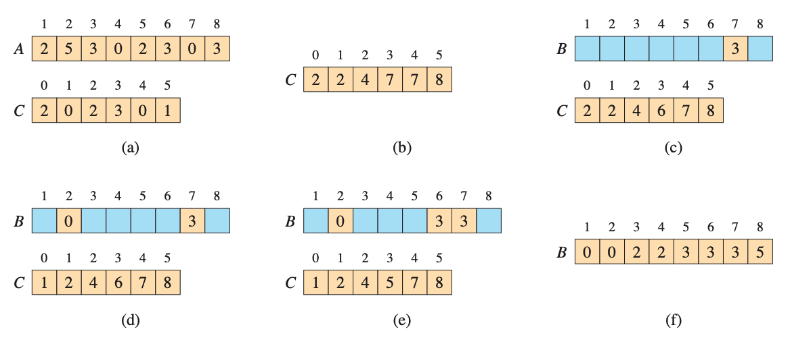

# Counting sort

Counting sort assumes that each of n input elements is an integer in the range 0 to k, for some integer k. It runs in $\theta$(n + k) time, sot that when k = O(n) 

```
COUNTING-SORT
1 let B[1:n] and C[0:k] be new arrays 
2 for i = 0 to k
3   C[i] = 0
4 for j = 1 to n
5   C[A[j]] = C[A[j]] + 1
6 // C[i] now contains the number of elements equal to i.
7 for i = 1 to k
8   C[i] = C[i] + C[i-1]
9  // C[i] now contains the number of elements less than or equal to i.
10 // Copy A to B, starting from the end of A.
11 for j = n downto 1
12  B[C[A[j]]] = A[j]
13  C[A[j]] = C[A[j]] - 1 // to handle duplicate values
14 return B
```

