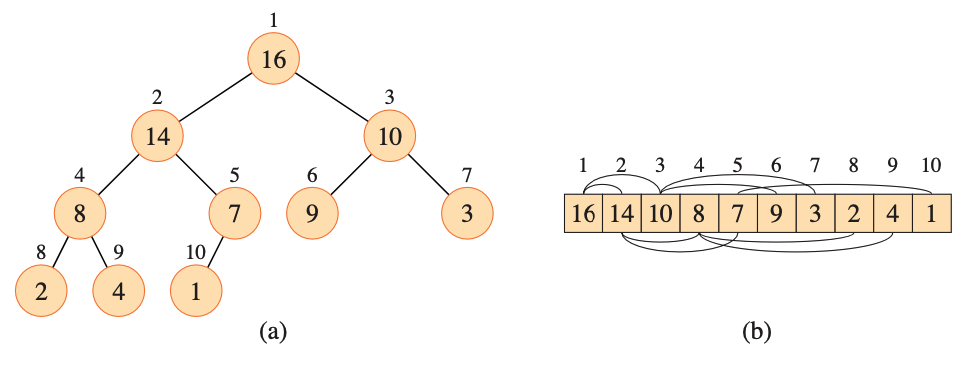
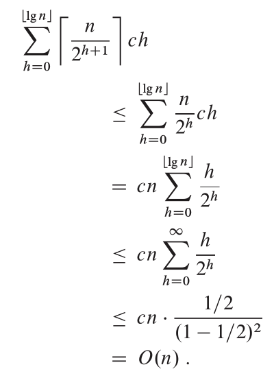

# Heap Sort

Heap sort makes a efficient priority queue, it has come to refer to "<strong>garbage collected storage</strong>" like feature provided by Java, JS and Python.

Heap data strcuture can be represented as almost complete binary tree and can be stored as array



### Time Complexity

for computing simple upper bound on running time of BUILD-MAX_HEAP makes O(lg(n)) time, and BUILD-MAX-HEAP makes O(n) such calls. Thus, the running time is O(nlg(n)). This upper bound though correct, is not tight as it can be.

We can derive a tighter asymptotic bound by observing that the time for MAX-HEAPIFY to run at a node varies with height of the node in the tree, and the heights of most nodes are small. our tighter analysis relies on the properties that n-element heap has height lower-bound(lgn) and at most upper-bound(n/2<sup>h+1</sup>) nodes of any height h.

The time required by MAX-HEAPIFY when called on a node of height of O(h). we can express total cost of BUILD_MAX_HEAP as being bounded from above by 

$$\sum_{h=0}^{lgn} (n/2^{h+1}) ch$$



Heapsort is asymptotically optimal among comparison-based sorting algorithms. Yet a good implementation of quick sort, usaully beats it in practice

On the contrary, if heapify is implemented as follows 

```
BUILD-MAX-HEAP'(A,n)
    A.heap-size = 1
    for i = 2 to n
        MAX-HEAP-INSERT(A[i])
```
The worst case complexity would be nlgn

### Priority Queues

Priority Queue is most popular application of a heap
A priority queue is data structure for maintaining a set S of elements, each with an associated value called a key.

supports follwoing operations
- Insert(S, x, k): inserts the element x with key k into the set S
- Maximum(S): returns the element of S with largest key.
- Extract-Max(S): removes and returns the element of S with largest key.
- Increase-Key(S, x, k): increases the value of element x's key to new value k, which is assumed to be at least as large as x's current key value.

Among their other applications, you can use max-priority queues to schedule jobs on a computer shared among multiple users. The max-priority queue keeps track of the jobs to be performed and their relative priorities. When a job is ûn- ished or interrupted, the scheduler selects the highest-priority job from among those pending by calling EXTRACT-MAX. The scheduler can add a new job to the queue at any time by calling INSERT.

Alternatively, a min-priority queue supports the operations INSERT, MINIMUM, EXTRACT-MIN, and DECREASE-KEY. A min-priority queue can be used in an event-driven simulator. The items in the queue are events to be simulated, each with an associated time of occurrence that serves as its key. The events must be simulated in order of their time of occurrence, because the simulation of an event can cause other events to be simulated in the future. The simulation program calls EXTRACT-MIN at each step to choose the next event to simulate. As new events are produced, the simulator inserts them into the min-priority queue by calling INSERT. We’ll see other uses for min-priority queues, highlighting the DECREASE-KEY operation.

