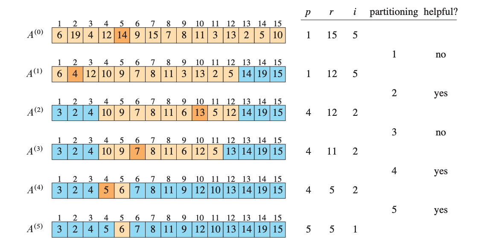

# Medians and order statistics

The ith order statistic of a set of n elements is the ith smallest element. For example, the minimum of a set of elements is the first order statistic (i=1), and the maximum is the nth order statistic (i=n). A median, informally is the halfway point fo the set. When n is odd, the median is unique, occuring at i=(n+1)/2. when n is even, there are two medians, the lower median occuring at i=n/2 and upper median occuring at i=n/2+1.

This is about the problem of selecting the ith order statistic from a set of n distinct numbers. We assume for the convenience that the set contains distinct numbers, although virtually everything we do extedns to the situation in which a set contains repeated values. 

We formally specify the selection problem as follows:

Input: A set A of n distinct numbers and an integer i, with 1 <= i <= n.
Output: The element x belongs to A that is larger than exactly i-1 other elements of A.

we can solve the selection problem in O(nlgn) time simply by sorting the numbers using heapsort or merge sort and then outputting the ith element in sorted array. 

### Minimum and Maximum
How many comparisons are necessary to determine the minimum of a set of n elements? To obtain an upper bound of n-1 comparisons, just examine each element of the set in turn and keep track of the smallest element seen so far. The MINIMUM procedure assumes that the set resides in array

```
MINIMUM(A,n)
1 min = A[1]
2 for i = 2 to n
3   if min > A[i]
4       min = A[i]
5 return min
```

Is this algorithm for minimum the best we can do? Yes, because it turns out that there’s a lower bound of n-1 comparisons for the problem of determining the minimum.

### Selection in expected linear time
This section presents a divide-and-conquer algorithm for the selection problem. The al- gorithm RANDOMIZED-SELECT is modeled after the quicksort algorithm of Chap- ter 7. Like quicksort it partitions the input array recursively. But unlike quicksort, which recursively processes both sides of the partition, RANDOMIZED-SELECT works on only one side of the partition.

This difference shows up in the analysis: whereas quicksort has an expected running time of $\theta$(nlgn), the expected running time of RANDOMIZED-SELECT is $\theta$(n).

```
RANDOMIZED-SELECT(A,p,r,i)
1 if == r
2   return A[p] // 1 <= i <= r-p+1 when p == r means that i = 1
3 q = RANDOMIZED-PARTITION(A,p,r)
4 k = q - p + 1
5 if i == k 
6   return A[q] 
7 elseif i < k
8   return RANDOMIZED-SELECT(A,p,q-1,i)
9 else return RANDOMIZED-SELECT(A,q+1,r,i-k)
```



The worst-case running time for RANDOMIZED-SELECT is $\theta$(n<sup>2</sup>), even to ûnd the minimum, because it could be extremely unlucky and always partition around the largest remaining element before identifying the th smallest when only one element remains. In this worst case, each recursive step removes only the pivot from consideration. Because partitioning elements takes $\theta$(n) time, the recurrence for the worst-case running time is the same as for QUICKSORT:

T(n) = T(n-1) + $\theta$(n) <br>
T(n) = $\theta$(n<sup>2</sup>)

We’ll see that the al- gorithm has a linear expected running time, however, and because it is randomized,
no particular input elicits the worst-case behavior.

For most average cases lets say it can ignore 1/4 of elements 

T(n) = T(3n/4) + $\theta$(n)
T(n) = $\theta$(n)