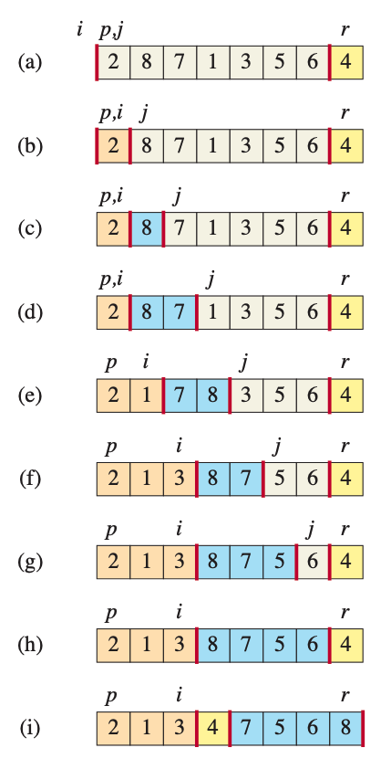
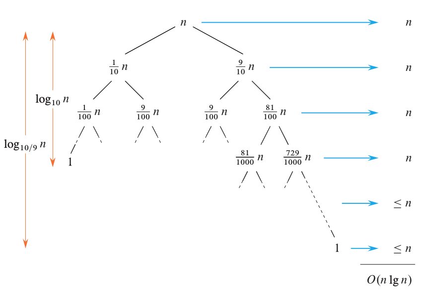

# Quick Sort

The quick sort algorithm has a worst-case running time of $\theta$(n<sup>2</sup>). Despite this slow worst-case running-time, quicksort is often the best pratical choice of sorting because it is remarkably efficient on average: $\theta$(nlgn). Unlike merge sort it sorts in place, works well even in virtual-memory environments.

Quicksort like merge sort applies divide-and-conquer method

- Divide:
    - by partitioning the array A[p:r] into two subarrays A[p:q-1] and A[q+1:r] such that each element in the low side of the partition is less than or equal to the pivot A[q], which is in turn less than or equal to each element in the high side. Compute index q of the pivot as part of this partitioning procedure.

- Conquer
    - by calling quicksort recursively to sort each of the subarrays A[p:q-1] and A[q+1:r]

- Combine
    - noting to do here

```
QUICKSORT(A,p,r)
1 if p < r
2   // Partition the subarray around the pivot, which ends up in A[q].
3   q = PARTITION(A, p, r)
4   QUICKSORT(A, p, q-1) // recursively sort the low side
5   QUICKSORT(A, q+1, r) // recursively sort the high side
```

### Partitioning the array

The key to the algorithm is PARTITION procedure which rearranges the subarray A[p:r] in place, returning the index of the dividing point between the two sides of partition.

```
PARTITION(A,p,r)
1   x = A[r]
2   i = p-1
3   for j = p to r-1
4       if A[j] <= x
5           i = i + 1
6           exchange A[i] with A[j]
7   exchange A[i+1] with A[r]
8   return i+1
```



### Performance of quicksort

The running time of quick sort depends on how balanced each partitioning is, which in turn depends on which elements are used as pivots. If two sides of a partition are about the same size, the partitioning is balanced, then algorithm runs asymptotically as fast as merge sort. If the partioning is unbalanced, however it can run asymptotically as slowly as insertion sort.

worst case partitioning:
when the partitioning produces one subproblem with elements and one with elements

T(n) = T(n-1) + T(0) + $\theta$(n)
     = T(n-1) + $\theta$(n)

T(n) = $\theta$(n<sup>2</sup>)

Moreover $\theta$(n<sup>2</sup>) running time occus when the input array is already completely sorted - a situation in which insertion sort runs in O(n)

Best case partitioning:
PARTITION produces two subproblems, each of size no more than n/2

T(n) = 2T(n/2) + $\theta$(n)
T(n) = $\theta$(nlgn)

Balanced partitioning
the average-case running time of quicksort is much closer to the best case than to the worst case. By appreciating how the balance of the partitioning affects the recurrence describing the running time, we can gain an understanding of why.
Suppose, for example, that the partitioning algorithm always produces a -to- proportional split, which at ûrst blush seems quite unbalanced. We then obtain the recurrence

T(n) = T(9n/10) + T(n/10) + $\theta$(n)



### A randomized version of quicksort

Many software li- braries provide a randomized version of quicksort as their algorithm of choice for sorting large data sets.
Instead of always using as the pivot, a randomized version randomly chooses the pivot from the subarray , where each element in has an equal probability of being chosen. It then exchanges that element with before partitioning. Because the pivot is chosen randomly, we expect the split of the input array to be reasonably well balanced on average.

```
RANDOMIZED-PARTITION (A, p, r)
1   i = RANDOM(p,r)
2   exchange A[r] with A[i]
3   return PARTITION(A,p,r)

RANDOMIZED-QUICKSORT(A,p,r)
1 if p < r
2   q = RANDOMIZED-PARTITION(A,p,r)
3   RANDOMIZED-QUICKSORT(A,p,q-1)
4   RANDOMIZED-QUICKSORT(A,q+1,r)
```